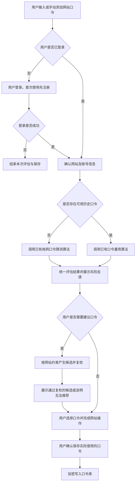
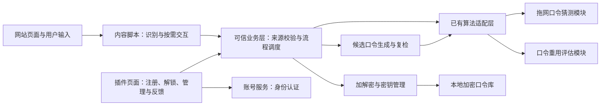

# 基于拖网猜测与重用猜测评估算法的浏览器口令管理插件

## 项目报告

**参赛场景：** 第五届中国研究生网络安全创新大赛电子科技大学校内赛——创意作品赛赛道（根据项目提出者提供的信息）  
**项目定位：** 面向普通互联网用户的口令存储、个性化风险评估与安全口令推荐工具  
**文档性质：** 项目设计报告；除团队已具备的算法外，本文功能、架构及验证安排均为拟实施方案，不代表已经完成开发或取得实测结果。

## 一、项目摘要

用户在不同网站注册和修改口令时，往往缺乏直观、可信的口令安全反馈。部分网站没有强度检测功能；即使存在检测功能，其结果也未必能反映用户跨网站重复使用口令，或在旧口令基础上进行简单修改所产生的风险。与此同时，多网站口令的记忆负担容易促使用户反复使用相同或相似口令。

本项目拟开发一款浏览器插件，将口令安全管理能力嵌入用户日常访问网站的过程，形成“输入口令—评估风险—提供建议—确认保存—后续调用”的业务闭环。插件支持用户注册、安全保存多个网站的账号口令，并依据口令库是否具有可用历史记录，自动选择团队已有的自主算法：无历史口令时，采用拖网口令猜测算法开展通用猜测风险评估；存在历史口令时，采用口令重用算法，结合用户旧口令评估新口令的重用及衍生风险。系统将算法输出转化为可理解的风险等级、原因提示和建议口令，帮助用户在设置口令时做出更安全的选择。

项目以本地加密存储和本地评估为优先设计，尽量减少网站口令暴露范围。创新重点在于把团队已有算法转化为面向真实注册、登录和改密场景的个性化安全辅助能力，而非仅展示单次口令评分。本文描述已有算法的调用条件、输入输出和工程集成方式，不展开其内部原理、训练方法或算法推导。

## 二、项目背景与需求分析

### 2.1 需要解决的问题

1. **用户难以感知口令风险。** 用户通常只能观察长度、字符种类等表面特征，难以判断一个口令是否容易被猜中。
2. **跨网站重用风险缺乏即时反馈。** 一个口令即使满足网站的格式要求，也可能与用户其他网站的口令相同或具有明显关联。
3. **网站安全提示能力不一致。** 用户在不同网站获得的反馈不统一，有的网站完全不提供检测功能。
4. **修改建议缺少可执行性。** 仅提示“口令较弱”不能直接帮助用户完成设置，还需要符合网站约束、通过评估的候选口令。
5. **多网站口令管理成本较高。** 安全建议应与可靠存储结合，使用户无需为了记忆方便而重复使用口令。

### 2.2 目标用户与使用场景

目标用户为需要管理多个互联网账号、希望获得口令安全辅助的普通用户，尤其适用于不具备专业安全知识的人群。

| 使用场景 | 用户需求 | 插件提供的能力 |
| --- | --- | --- |
| 首次使用插件并保存网站口令 | 判断当前口令是否容易被猜中 | 拖网口令猜测评估、风险提示、候选口令 |
| 已存储口令后注册新网站 | 避免直接复用或简单修改旧口令 | 基于历史口令的个性化重用风险评估 |
| 修改已有网站口令 | 确认新口令与旧口令及其他网站口令的关联风险 | 评估后更新记录，保留明确的更新确认步骤 |
| 访问已保存账号的网站 | 方便、安全地取得对应口令 | 解锁口令库、选择账号并按需填充或复制 |
| 回顾已有口令 | 识别需要优先更换的口令 | 展示有效的评估记录，并提供重新评估入口 |

### 2.3 项目边界

“存储所有网站的口令”在本项目中指提供跨网站的统一口令库，支持用户添加任意网站记录，不代表插件能够自动读取所有网站的现有口令，也不承诺对所有页面实现自动识别和填充。对于特殊表单、跨域嵌入页面或浏览器限制页面，提供手动录入和管理入口。

插件只处理用户主动输入、主动添加或明确确认保存的凭据。插件账号、口令库主口令和第三方网站口令承担不同职责，不应混用。插件本身不替用户注册第三方网站，也不因用户修改口令库记录而自动修改网站端口令。

## 三、建设目标与功能设计

### 3.1 建设目标

建立可演示、可验证的浏览器端口令安全辅助系统，实现以下目标：

- 支持插件用户注册、登录以及口令库初始化与解锁。
- 支持多个网站、同一网站多个账号的口令记录管理。
- 按历史口令可用性调用两类自主算法，形成清晰、可追溯的评估路径。
- 输出风险等级及可理解的反馈，提供符合条件且通过复检的建议口令。
- 采用应用层加密及最小权限设计，降低口令集中保存带来的风险。
- 通过功能、评估效果、安全与可用性测试证明方案的可行性。

### 3.2 核心功能

| 功能模块 | 主要功能 | 设计要求 |
| --- | --- | --- |
| 用户管理 | 注册、登录、退出及账号状态管理 | 插件身份认证与口令库解密分离 |
| 口令库 | 新增、查看、编辑、删除、按网站和账号检索 | 口令及敏感元数据加密保存 |
| 页面辅助 | 识别口令输入场景、发起评估、提示保存或更新 | 按站点授权，提供手动操作入口 |
| 评估调度 | 判断历史记录、选择算法、统一结果格式 | 区分无历史、锁定、超时及不可用状态 |
| 风险反馈 | 等级、原因类别、建议动作 | 不把字符复杂度等同于实际抗猜测能力 |
| 建议口令 | 根据网站约束产生候选、执行评估复检 | 不直接沿用旧口令变体，不作绝对安全承诺 |
| 凭据调用 | 查看、复制或用户触发填充 | 先核对网站，再提供对应账号凭据 |
| 安全控制 | 锁定、自动锁定、敏感操作再确认、加密备份 | 控制明文、密钥及备份的暴露范围 |

## 四、业务流程

### 4.1 用户注册与初始化

1. 用户安装插件，阅读功能及数据处理说明，按需授权目标网站访问权限。
2. 用户在插件受信任界面创建插件账号，完成身份认证所需的注册步骤。
3. 用户设置独立的口令库主口令。客户端利用主口令建立本地密钥保护机制，生成并加密保存口令库密钥。
4. 插件建立空口令库，进入已解锁状态，显示“尚无网站口令记录”。
5. 后续使用时，登录插件账号用于确认身份，输入主口令用于解锁数据；账号已登录不意味着口令库已经解锁。

原型采用“账号服务负责身份认证、本地口令库负责凭据存储”的分工。多端同步可作为后续扩展；如实现同步，仅上传在客户端完成加密的口令库数据。账号密码重置不能直接恢复主口令所保护的数据，恢复机制需另行设计并向用户说明。

### 4.2 新增网站口令的主流程

每次新增或修改口令时，系统都提供获取建议口令的入口；评估发现明显风险时，主动展示替换建议。用户可以保留原口令，但需要明确看到相应风险提示。插件不得未经用户操作修改网站表单或提交网站请求。

### 4.3 无历史口令：通用强度评估

首次保存口令时，系统尚未掌握用户的历史口令，因此调用团队已有的拖网口令猜测算法，对候选口令开展通用猜测风险评估。此处“拖网”指面向一般口令分布的非个性化猜测评估，不表示对外部网站进行在线试探或攻击。

系统将算法的原生输出转换为经过标定的风险等级，并展示简明说明。若风险较高，用户可获取建议口令；候选口令经过适用的评估后，才可以标记为“达到当前推荐标准”。用户确认后，将实际使用的口令加密保存，为后续个性化评估提供历史依据。

### 4.4 有历史口令：重用风险评估

只要存在至少一条可用历史口令，即进入重用评估分支，不必等到保存多条后才启用。评估时取出当前用户已解锁口令库中的相关历史口令，在本地调用团队已有的口令重用算法。

该分支用于回答“新口令在已知用户旧口令的条件下，是否存在较高的重用或可推测风险”。它与无历史场景的通用抗猜测评估具有不同含义，因此界面应标注评估类型。“未发现明显重用风险”不能直接解释为“通用强度很高”。

核心业务路由遵循上述两分支设计。若已有重用算法仅输出相似性或重用风险，不能独立支撑综合强度结论，则增加通用评估作为补充检查，或者仅展示重用风险结论；具体取决于已有算法的输出能力。建议口令要获得推荐状态，应同时满足适用的通用强度要求和历史重用风险要求。

历史记录只在当前用户的数据范围内使用。新候选口令在评估完成前不进入历史集合，避免与自身比较；修改已有网站口令时，其原口令仍可作为历史依据，以识别在旧口令基础上的简单修改。普通存量口令复检则需排除记录自身。

### 4.5 建议口令与保存流程

1. 获取或由用户确认网站的长度、字符集、禁用字符等要求；无法识别时不假定已满足网站全部规则。
2. 调用团队已有的口令生成能力；若现有算法不包含生成模块，则通过标准安全随机数能力实现工程生成，不另外宣称拥有新的自研生成算法。
3. 对候选口令执行适用的强度与重用风险复检。
4. 展示达到当前阈值的候选，允许重新生成、复制或经用户确认后填入当前页面。
5. 用户完成网站注册或修改操作后，确认保存实际使用的口令。仅复制或填入候选不视为网站已经接受该口令。
6. 达到尝试次数或耗时上限仍没有合格候选时，说明约束冲突或评估不可用，不降低标准后继续标记为安全。

“强度足够”定义为满足当前评估模型、设定阈值和网站约束，不表示口令不可破解。

### 4.6 日常调用、更新与异常处理

- **调用：** 用户解锁口令库后，插件核验当前站点，展示对应账号；用户选择后再填充或复制。
- **更新：** 对新口令重新评估，用户确认网站改密成功后再替换旧记录；无法可靠判断结果时要求用户手动确认。
- **删除：** 用户确认后删除记录，后续评估不再使用该记录；不默认长期保留已删除口令或额外的历史明文副本。
- **锁定：** 用户主动锁定、空闲超时或浏览器会话结束时关闭口令库；敏感运行上下文失效后重新解锁。
- **算法故障：** 超时、资源不足或输出异常时显示“暂无法评估”，不显示默认强等级；允许用户知情后仅保存记录，并标记未评估。
- **历史不可读：** 口令库锁定或数据损坏不等同于没有历史口令，不悄然转入首次评估分支。

## 五、系统总体架构

### 5.1 架构分层

系统采用“浏览器交互层—可信业务层—算法适配层—加密存储层”的结构，账号服务与网站口令处理路径分离。

内容脚本负责页面侧最少必要的识别和交互，不获得完整口令库或主密钥。明文历史口令只在已解锁的可信扩展运行环境内供算法按需使用。网页不能通过普通消息接口读取历史口令、列举全部账号或请求任意解密。

### 5.2 模块职责

| 模块 | 职责 | 主要边界 |
| --- | --- | --- |
| 插件界面 | 注册、解锁、口令库管理及风险展示 | 主口令仅在可信扩展界面输入 |
| 内容脚本 | 表单识别、候选输入监听、按需填充 | 只处理当前站点与当前操作所需数据 |
| 业务调度 | 校验消息、选择算法、协调保存与更新 | 依据浏览器提供的来源信息判断站点 |
| 算法适配层 | 封装已有算法，转换数据及输出 | 不修改算法核心，也不伪造解释信息 |
| 生成与复检 | 生成候选、检查约束、调用评估 | 通过复检后才能标记达到推荐标准 |
| 加密存储 | 管理密钥、加密读写、锁定与备份 | 不向网页或账号服务提供明文网站口令 |
| 账号服务 | 注册、认证、会话与账号状态管理 | 不接收网站口令和口令库主口令 |

### 5.3 数据设计

一条网站凭据记录包括记录标识、站点匹配信息、账号名、口令、创建及更新时间、评估模式、风险等级、算法版本和评估时间。站点、账号名、风险标签等信息也可能暴露用户隐私，应与口令一起纳入加密载荷。

存储外层仅保留读取密文所需的最少字段，例如数据格式版本、随机盐、密钥派生参数、加密随机数、密文及认证标签；算法相关版本信息可保存于加密载荷。风险结果与凭据版本绑定，口令变化后旧结果失效。新增或删除历史记录、模型版本变更时，旧重用评估结果应标注为可能过期并支持重新评估。

原型不默认积累所有被替换的历史口令，以减少敏感数据留存。后续如需保留有限历史用于评估，应提供明确开关、保留期限和删除机制。

## 六、关键技术

### 6.1 既有自主算法的工程集成

项目涉及的拖网口令猜测算法和口令重用算法均由团队自主开发且已具备，本文不描述其具体实现。工程重点是统一调用契约、隔离计算任务、管理版本和处理异常。

| 算法模块 | 调用条件 | 输入 | 输出接入要求 |
| --- | --- | --- | --- |
| 拖网口令猜测算法 | 无可用历史口令；必要的通用复检 | 候选口令、评估配置 | 保留原生分数或等级、执行状态、算法版本 |
| 口令重用算法 | 至少有一条可用历史口令 | 候选口令、当前用户历史口令集合、评估配置 | 保留原生风险结果；有依据时提供原因类别 |

适配层将结果整理为统一业务结构，包括 `status`、`mode`、`native_result`、`risk_level`、`reason_codes`、`algorithm_version` 和 `evaluated_at`。其中原因类别、置信度、估计猜测次数等只能在已有算法确实支持时输出，不能由界面层凭空补充。

优先采用可在浏览器本地运行的封装形式；若算法依赖不适合直接移植，则评估用户显式安装的本机计算组件方案。封装可行性、模型体积、启动时间、内存和时延均须实测。若本地运行仍不可行，应重新设计部署方式及隐私边界，不能默认上传明文口令到云端。

#### 6.1.1 模型接口扩展：支持不同评估与建议口令实现

在原有算法适配层增加统一模型接口，使插件能够选择不同模型进行强度计算，并接入不同的建议口令提供方式。该扩展保持本文主要框架、无历史拖网/有历史重用分支及原有补检条件，账号、存储、推荐复检和保存流程不作调整。

| 接口能力 | 输入与输出 | 接入方式 |
| --- | --- | --- |
| 拖网强度计算 ASSESS_TRAWLING | 候选口令 → 原生强度指标及模型身份 | 默认已有拖网模型，可换兼容模型 |
| 重用风险计算 ASSESS_REUSE | 候选口令与适用历史 → 原生重用指标及模型身份 | 默认已有重用模型，可换兼容模型 |
| 建议候选提供 GENERATE_CANDIDATES | 网站约束、数量与预算 → 待复检候选 | 默认安全随机生成，可接支持生成的模型 |

评估与生成是独立能力。模型可仅用于强度计算，与原有随机生成器组合筛选建议；也可实现生成接口，提供候选交给原有评估流程复检。没有生成能力不妨碍模型用于评分。重用模型产生的旧口令衍生猜测列表不直接作为建议口令。

适配器声明模型 ID/版本、支持能力、输入字符与长度范围、必需上下文和原生指标类型。调用方可配置模型 ID，未指定时保持原默认模型；框架不要求调用方理解模型内部结构。新增模型主要通过适配器及配置接入，不修改算法核心，不将当前模型的字符或长度限制固化为全部模型的限制。具体字段与调用规范见 PROMPT.md §5.7 和开发框架 §7.1.1。

结果继续沿用原有统一结构，补充实际模型身份及指标类型。猜测次数、列表排名、概率及其它评分分别解释和标定，不直接相加、平均或互换；新模型没有标定时明确提示，不能借用旧模型等级阈值。模型更换后原评估结果需按版本校验或重新评估。

建议候选不因模型生成成功就表示安全，仍需满足网站约束和原流程规定的强度/重用复检。生成接口默认不接收历史口令、用户名或站点模板。保留原安全随机生成作为默认实现；生成模型适用性需验证，不能以自身评分证明安全。模型不可用、缺失能力、越域、超时或输出异常均明确报告，不降低推荐标准。

本方案在现有适配层上扩展，技术上可行；主要新增工作为能力描述、模型选择、适配器封装和按模型标定。可扩展性通过替换评估/生成提供器且原业务流程不变来验证，实际强度识别和建议效果通过独立数据与性能实测验证。接口可替换不等于所有模型都能直接加载，也不等于模型数量增加必然提高安全性。本扩展继续遵守原本地执行与隐私边界，不新增远程明文评分服务。

### 6.2 风险等级映射与解释反馈

业务层可以统一采用“低风险、中风险、高风险”表达，但不同算法的原始量纲不能直接相加、平均或比较。各算法分别使用其验证依据标定等级阈值，界面同时显示评估模式与适用范围。

典型反馈文案包括：

- “该口令在通用猜测评估中风险较高，建议更换。”
- “该口令与已保存口令存在重用风险，建议为此网站设置独立口令。”
- “本次未发现明显重用风险；该结果仅反映当前已保存口令范围。”
- “评估暂时不可用，当前没有可确认的强度结论。”

不在网页提示中展示旧口令明文或可推断旧口令的详细变换方式。除非算法提供经过验证的猜测成本模型及相应攻击假设，否则不展示“需要若干年破解”等精确时长。

### 6.3 本地加密与密钥管理

浏览器扩展存储本身不能替代口令库加密。Chrome 官方文档提醒扩展存储并非加密存储，因此本项目在写入浏览器持久化介质前实施应用层加密。[参考资料 1](https://developer.chrome.com/docs/extensions/develop/security-privacy/user-privacy)

拟采用以下密钥分层设计：

1. 用户设置主口令，通过经过审查的口令密钥派生方案和随机盐派生密钥加密密钥；具体参数结合目标设备测试确定。
2. 独立随机生成口令库数据密钥，用主口令派生出的密钥加密保护数据密钥。
3. 使用标准认证加密方案，例如 AES-GCM，对凭据及敏感元数据加密，同时验证密文完整性；同一密钥下必须确保每次加密使用唯一的 nonce。
4. 修改主口令时重新保护数据密钥；若数据密钥可能泄露，则执行密钥轮换并重新加密数据。
5. 持久化存储中不保存主口令或明文数据密钥；解锁期间尽量缩短明文与密钥在内存中的生命周期。

浏览器标准 Web Crypto API 可提供相关密码学基础能力，但其正确使用、参数管理和完整密钥生命周期仍需单独设计与检查。[参考资料 2](https://developer.mozilla.org/en-US/docs/Web/API/Web_Crypto_API)

团队自研算法用于口令安全评估，不替代标准加密和密钥保护机制。JavaScript 环境难以保证所有内存副本都被物理清零，因此系统承诺应限定为缩短明文存活时间和释放引用，不宣称能够彻底消除内存残留。

### 6.4 站点识别与安全填充

页面识别应覆盖常规口令输入框、动态加载表单和同站点多账号选择，并提供手动入口应对兼容性限制。凭据调用默认采用严格站点绑定，以协议、主机及必要的端口信息确定匹配范围，不采用简单字符串包含或后缀匹配。

跨子域共用账号仅在用户明确配置后允许；跨域框架、跳转站点及未加密页面不得未经核验直接填充。填充前由可信业务层校验浏览器提供的标签页与框架来源，不能只相信页面传入的站点名称。

历史口令、主口令和密钥不得传给网页。用户主动填入的当前网站口令会进入该页面，因此本地加密并不能消除恶意网站读取其自身表单内容的风险。

### 6.5 候选口令生成与约束适配

候选生成采用安全随机来源，避免把网站名、账号名或旧口令变体作为生成模板。浏览器提供的 `crypto.getRandomValues()` 可用于获得密码学安全随机值；字符抽样还需避免不恰当映射造成的偏差。[参考资料 3](https://developer.mozilla.org/en-US/docs/Web/API/Crypto/getRandomValues)

生成器在网站约束范围内生成候选，经评估合格后展示。推荐强度阈值、候选最大尝试次数和耗时上限均作为配置管理。生成的候选在用户确认前不持久化，不进入遥测日志或错误报告。

### 6.6 性能与交互一致性

对连续输入采用防抖和取消过期任务机制，计算尽量放在适当的独立执行环境中，避免阻塞页面。每个评估请求绑定输入版本及口令库版本，只有与当前状态一致的结果才允许展示或用于保存，防止旧结果覆盖新输入。

仅在必要时读取历史口令；单次会话内可复用必要计算状态，但锁定后释放敏感状态。插件后台生命周期变化、页面刷新和浏览器重启后，应恢复为可明确解释的状态；不得为了维持运行而把解密密钥明文写入持久化存储。

## 七、安全与隐私设计

### 7.1 主要风险及应对

| 风险 | 设计措施 | 能力边界 |
| --- | --- | --- |
| 本地口令库文件被复制 | 应用层认证加密、主口令密钥派生 | 仍依赖主口令质量及派生参数 |
| 账号服务泄露 | 身份认证与口令库解密分离，服务器不保存网站明文口令 | 不能据此宣称全部系统绝对安全 |
| 恶意网页探测插件 | 消息白名单、来源校验、最少数据返回 | 用户主动提供给当前网页的口令仍可被网页读取 |
| 错误网站或框架收到凭据 | 严格站点匹配、框架校验、用户触发填充 | 特殊登录跳转需显式配置和验证 |
| 日志或异常报告泄露 | 禁止记录明文口令、候选口令、历史集合和密钥 | 调试构建也执行相同限制 |
| 无人值守设备被操作 | 空闲锁定、敏感操作再次验证 | 不能防御已全面控制设备的攻击者 |
| 剪贴板泄露 | 仅用户触发复制，减少停留时间 | 不能保证其他程序未读取或系统历史已清除 |
| 算法误判 | 标注评估范围、保留版本、开展独立验证 | 风险等级是模型评估，不是安全保证 |

### 7.2 数据处理原则

系统仅为口令管理和评估处理必要数据，不收集完整浏览历史，不将口令或可用于猜测口令的衍生数据用于统计上报。站点权限按实际使用申请，口令库访问限制在可信模块。备份默认采用加密格式，恢复需验证密文完整性并由用户解锁。

注册功能的认证凭据应使用适当的服务端口令验证机制保存，通过安全连接传输，并设置失败尝试限制；其验证凭据不能直接充当口令库解密密钥。

## 八、项目特色与创新价值

### 8.1 从单个口令检测扩展到用户口令集合评估

项目将用户已保存的口令作为个性化评估上下文，使安全反馈能够反映跨网站重用及关联风险。其价值在于识别单个口令表面复杂度难以揭示的问题。相对于具体同类产品的优势仍需对比验证，本文不作首创或全面领先的结论。

### 8.2 兼顾首次使用与持续使用

通过无历史与有历史两条评估路径，首次使用者也能获得反馈；随着用户保存口令，系统进一步提供基于个人历史的风险判断。历史增加不意味着评估准确率必然提升，实际效果由后续实验验证。

### 8.3 在口令设置时提供可执行帮助

系统把风险提示、建议口令、复检和保存连接起来，使用户能够在网站注册或改密时完成调整。插件既降低安全口令的使用负担，也让算法输出成为可以直接辅助决策的信息。

### 8.4 算法能力与隐私保护协同落地

通过本地优先的计算和加密架构，探索在不向账号服务暴露网站口令的情况下使用个人历史信息。实现难点不仅是评分本身，还包括算法封装、敏感状态控制和浏览器交互边界。

## 九、实施计划与验证方案

### 9.1 分阶段实施

| 阶段 | 主要工作 | 可验收产物 |
| --- | --- | --- |
| 第一阶段：接口与边界确认 | 核对已有算法输入输出、本地运行条件及页面权限 | 接口说明、威胁模型、页面原型 |
| 第二阶段：基础口令库 | 注册登录、初始化、解锁及加密增删改查 | 可运行的口令库与测试记录 |
| 第三阶段：评估闭环 | 接入两类算法、等级映射、候选生成和复检 | 可演示的新口令评估流程 |
| 第四阶段：浏览器场景集成 | 表单识别、授权站点匹配、保存更新及按需填充 | 代表性网站兼容性结果 |
| 第五阶段：验证与答辩准备 | 效果、安全、性能和可用性验证 | 实测报告、演示视频及答辩材料 |

### 9.2 功能与安全验证

至少覆盖以下测试场景：

1. 空口令库调用拖网评估；存在一条和多条历史口令时均调用重用评估。
2. 原样复用、旧口令变体和独立新口令的结果记录，核对调用及解释是否符合已有算法能力。
3. 网站改密场景保留原口令作为评估依据；存量复检不会把记录与自身比较。
4. 候选口令满足网站约束并通过复检；约束冲突、超时及失败不会返回错误的强等级。
5. 口令库锁定、损坏、评估失败和快速连续输入时，界面状态正确且不展示过期结果。
6. 从持久化文件、扩展存储、网络请求和日志中检查是否出现口令、主密钥等敏感明文。
7. 篡改密文、使用错误主口令、伪造消息来源或在错误站点请求填充时，系统拒绝相关操作。
8. 网站注册或改密失败时，不自动把尚未生效的新口令覆盖到正式记录。

### 9.3 效果与性能指标

| 验证维度 | 拟记录指标 | 说明 |
| --- | --- | --- |
| 评估效果 | 已有算法适用的准确率、召回率、误报率或排序指标 | 依据真实输出与标注选择，不强行套用不适用指标 |
| 个性化价值 | 同一测试集上通用评估与重用评估的风险识别差异 | 分别设置无历史、单条历史及多条历史条件 |
| 推荐效果 | 约束满足率、复检通过率、生成失败率 | 用户接受率需另外开展用户测试 |
| 运行性能 | 首次加载、评估耗时的中位数及 P95、峰值内存 | 标注设备、浏览器、模型版本和历史记录规模 |
| 兼容性 | 选定网站或测试页面的识别、保存和填充成功率 | 不能由少量样本推出所有网站均兼容 |
| 可用性 | 完成保存或改密任务的时间、操作错误及反馈理解情况 | 使用测试账号与专用测试口令 |

算法数据集采用团队已获授权的数据或专用合成测试样本，不收集参赛体验者的真实网站口令。训练、阈值标定和最终测试数据应适当隔离，涉及个人口令序列时避免同一用户信息跨集合泄漏。

所有性能目标应在基线测量后确定。报告当前不填写未经验证的准确率、毫秒级响应时间或用户规模。推荐口令通过自身评估只说明符合本系统标准，不能作为算法有效性的独立证据，仍需使用独立测试依据验证。

## 十、比赛演示方案与预期成果

### 10.1 建议演示流程

使用专用测试页面和虚构账号完成以下演示：

1. 注册插件账号并初始化空口令库，展示账号登录与口令库解锁的区别。
2. 输入第一条测试口令，展示拖网评估、风险反馈及建议口令，确认保存。
3. 为第二个测试网站输入与已有口令相同或相关的测试口令，展示重用评估及解释。
4. 获取新的候选口令，展示约束检查和复检结果，用户完成网站操作后保存。
5. 返回已保存的网站，展示站点核验、账号选择和用户触发填充。
6. 锁定口令库并展示无法读取凭据；使用开发测试材料展示持久化数据为密文。

演示应同时准备算法超时、口令库锁定和网站约束过严等异常案例，体现真实交互中的处理能力。演示结果如使用模拟数据或占位接口，必须明确标注，不能作为真实算法效果呈现。

### 10.2 预期交付物

- 可安装运行的浏览器插件原型及必要的账号服务。
- 团队已有算法的封装模块、接口说明和版本记录。
- 本地加密口令库、密钥管理及安全边界说明。
- 功能、效果、安全、性能及兼容性测试材料。
- 项目说明书、操作演示视频和答辩展示材料。

### 10.3 后续扩展

在核心流程验证后，可逐步扩展加密备份与恢复、多端密文同步、更多浏览器适配及口令库风险复查能力。扩展应以已验证的基础功能为前提，避免扩大敏感数据的收集范围或削弱本地加密边界。
