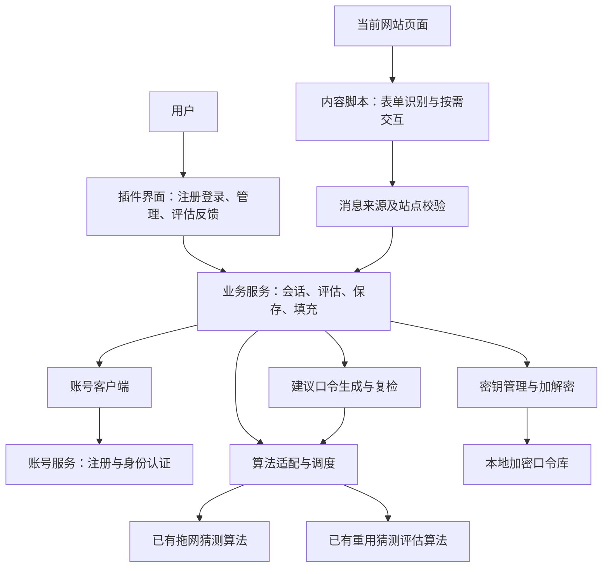
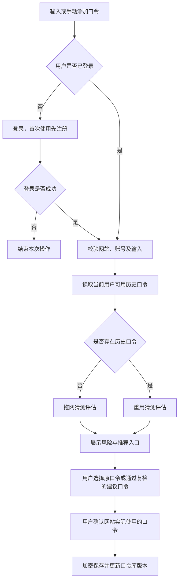

# 浏览器口令管理插件——项目开发框架

## 一、文档定位与设计约定

本框架依据同目录下的《基于拖网猜测与重用猜测评估算法的浏览器口令管理插件》项目报告编写，用于指导后续项目搭建、模块分工、接口对接和联调验收。本文中的目录及代码结构为拟建结构，本次只交付 Markdown 框架说明，不代表已经创建或实现对应程序文件。

核心业务为：**用户注册或登录 → 输入网站口令 → 根据历史口令选择评估算法 → 反馈风险并提供建议口令 → 用户确认保存 → 后续管理和调用。**

本框架采用以下约定：

1. 对用户提供统一的注册、登录入口，不再在主业务流程中增加单独的“解锁口令库”页面。内部必须在身份认证和本地密钥恢复均成功后，才进入可使用状态。
2. 为沿用原报告的密钥隔离设计，初版登录表单可包含账号认证信息和本地口令库主口令，通过一次提交完成两项操作；主口令只供本地处理。统一入口不表示两种口令必须相同。若后续要求仅输入一个口令，需单独确定同时满足认证和密钥保护要求的方案。
3. 网站口令、历史口令集合与口令库主口令不发送到账号服务器，算法优先在本地执行。
4. 无历史口令时调用已有拖网猜测算法；存在至少一条历史口令时调用已有重用猜测评估算法。
5. 两类评估算法均复用团队已有成果，框架只定义适配接口，不设计新的算法核心。
6. 首期覆盖注册登录、加密口令库、评估反馈、建议口令和用户触发填充；多端同步作为扩展，不进入首期必做范围。

## 二、系统组成



| 组成部分 | 职责 | 数据边界 |
| --- | --- | --- |
| 插件界面 | 注册登录、口令列表、编辑、风险结果、推荐结果 | 完整凭据只在已登录的可信界面按需显示 |
| 内容脚本 | 识别表单、取得本次候选输入、执行授权填充 | 不接收历史口令集合或口令库密钥 |
| 插件业务服务 | 会话检查、评估调度、保存及更新、站点匹配 | 所有敏感操作统一经过权限检查 |
| 算法适配模块 | 调用已有算法、转换原生结果、管理超时和版本 | 明文评估输入仅在本地计算路径内流转 |
| 加密存储模块 | 初始化、密钥恢复、加密读写、退出清理 | 只将密文和必要加密参数写入持久化介质 |
| 账号服务 | 注册、身份认证、会话撤销和状态管理 | 不设置网站口令上传或远程评分接口 |

## 三、工程目录与文件规划

下列路径均相对于未来项目根目录 `password-guard/`。浏览器侧采用 TypeScript 的文件命名表达职责；服务端以 Python 工程表达结构，具体框架和依赖版本在建项时确定。目录划分不依赖特定 UI 框架。

```text
password-guard/
├── README.md                         # 项目说明、启动方法、功能边界
├── .gitignore                        # 排除密钥、真实数据、本地配置和构建产物
├── .env.example                      # 配置变量名及占位值，不含真实秘密
├── extension/                        # 浏览器插件
│   ├── package.json                  # 前端依赖与开发、构建、测试命令
│   ├── tsconfig.json                 # TypeScript 配置
│   ├── manifest.json                # 插件入口、权限及资源声明
│   ├── public/
│   │   └── icons/                   # 插件图标
│   └── src/
│       ├── background/
│       │   ├── index.ts             # 后台入口与生命周期协调
│       │   ├── message-router.ts    # 消息分发及参数校验
│       │   └── sender-guard.ts      # 来源、标签页和框架校验
│       ├── content/
│       │   ├── index.ts             # 内容脚本入口
│       │   ├── form-detector.ts     # 常规及动态表单识别
│       │   ├── input-observer.ts    # 输入防抖及候选版本管理
│       │   └── fill-controller.ts   # 经授权填充，不自动提交
│       ├── ui/
│       │   ├── popup/               # 当前网站入口、状态及快捷操作
│       │   ├── pages/
│       │   │   ├── register.ts      # 注册及本地口令库初始化
│       │   │   ├── login.ts         # 统一登录入口
│       │   │   ├── vault.ts         # 网站及账号记录列表
│       │   │   ├── credential.ts    # 新增、编辑、查看记录
│       │   │   ├── assessment.ts    # 风险反馈和建议口令
│       │   │   └── settings.ts      # 权限、会话超时等设置
│       │   └── components/          # 风险标签、确认框等公共组件
│       ├── services/
│       │   ├── auth-service.ts      # 账号认证及初始化流程协调
│       │   ├── session-service.ts   # 可用会话、过期和退出处理
│       │   ├── vault-service.ts     # 凭据增删改查及事务控制
│       │   ├── assessment-service.ts # 评估场景及算法路由
│       │   ├── history-service.ts   # 历史集合选择与版本管理
│       │   ├── recommendation-service.ts # 候选生成、约束检查、复检
│       │   └── site-service.ts      # 站点规范化及严格匹配
│       ├── algorithms/
│       │   ├── contracts.ts         # 已有算法的接入契约
│       │   ├── trawling-adapter.ts  # 拖网猜测算法适配
│       │   ├── reuse-adapter.ts     # 重用猜测评估算法适配
│       │   ├── result-mapper.ts     # 分算法阈值映射和原因转换
│       │   ├── runtime.ts           # 本地执行、取消、超时及资源释放
│       │   └── assets/              # 经确认可分发的模型或运行资源
│       ├── security/
│       │   ├── key-manager.ts       # 派生、恢复、保护及轮换密钥
│       │   ├── vault-crypto.ts      # 认证加密与完整性校验
│       │   ├── password-generator.ts # 调用已有生成能力或标准随机生成
│       │   └── sensitive-state.ts  # 敏感内存状态生命周期
│       ├── storage/
│       │   ├── vault-repository.ts  # 密文读写，不接收业务层裸明文写入
│       │   └── migrations.ts        # 存储结构版本迁移
│       ├── api/
│       │   └── account-client.ts    # 仅调用账号服务
│       └── shared/
│           ├── types.ts             # 凭据、评估和会话类型
│           ├── messages.ts          # 插件内部消息协议
│           ├── errors.ts            # 统一错误码
│           └── config.ts            # 算法版本、阈值配置入口
├── server/                           # 账号服务，不承担网站口令评估
│   ├── pyproject.toml               # Python 依赖及工具配置
│   ├── app/
│   │   ├── main.py                  # 应用入口
│   │   ├── api/auth.py              # 注册、登录、退出、会话查询
│   │   ├── services/auth.py         # 认证业务、失败限制和会话撤销
│   │   ├── models/user.py           # 用户与认证验证数据
│   │   ├── models/session.py        # 会话记录
│   │   ├── repositories/            # 数据访问层
│   │   └── core/                    # 配置、安全及日志脱敏
│   └── migrations/                  # 账号数据库结构迁移
├── native-host/                      # 可选：算法不能直接浏览器运行时启用
│   └── README.md                    # 本机接入、安装及消息边界说明
├── tests/
│   ├── unit/                        # 历史选择、结果版本、站点匹配等
│   ├── integration/                 # 加密读写、算法适配、注册登录
│   ├── e2e/                         # 首次保存、重用检测、改密、填充
│   ├── security/                    # 密文篡改、消息伪造、错误来源
│   └── fixtures/                    # 虚构账号、测试口令和测试页面
└── docs/
    ├── architecture.md              # 架构及模块边界
    ├── algorithm-contract.md        # 两类已有算法对接说明
    ├── api-contract.md              # 账号服务及插件内部接口
    ├── security-design.md           # 密钥、权限、恢复策略
    ├── test-plan.md                 # 验收方法与真实结果
    └── demo-guide.md                # 比赛演示步骤
```

`native-host/` 为条件性扩展，只有已有算法无法适配浏览器运行时才实施。不能仅因目录中预留该模块就默认用户已经安装本机程序。

## 四、主要页面与交互

| 页面 | 输入或操作 | 结果 |
| --- | --- | --- |
| 注册页 | 账号信息、认证口令、本地口令库主口令 | 创建账号，初始化加密口令库，进入可用会话 |
| 登录页 | 账号认证信息及本地所需的密钥恢复信息 | 同一次交互中完成认证与密钥恢复 |
| 插件弹窗 | 当前站点、账号选择、检测或新增入口 | 进入当前网站的相关操作 |
| 口令库页 | 搜索、新增、选择、删除 | 管理同一用户的多网站及多账号凭据 |
| 记录编辑页 | 网站、账号、候选口令 | 发起评估，确认实际使用的口令后保存 |
| 评估结果区 | 查看结果、请求推荐、重新生成 | 显示评估模式、风险和推荐状态 |
| 设置页 | 超时、站点授权、退出 | 更新配置或结束当前会话 |

注册成功但本地初始化失败时保留可重试入口，不能反复创建账号。认证成功但本地数据无法解密时，不进入口令库，也不当作空库新建。

## 五、关键业务流程及模块调用

### 5.1 统一注册登录

```text
注册或登录界面
  → auth-service：账号注册或认证
  → key-manager：初始化或恢复本地数据密钥
  → vault-service：校验并打开当前用户口令库
  → session-service：建立可用会话
  → 展示口令库或返回此前操作
```

对外状态设为 `SIGNED_OUT`、`SIGNING_IN`、`READY`。只有 `READY` 可以读写凭据和评估。退出、空闲超时、密钥上下文丢失或会话失效后回到 `SIGNED_OUT`，界面提示重新登录。账号令牌仍存在不等于本地口令库可用。

### 5.2 新增与评估



调用链：`assessment-service → history-service → algorithm adapter → result-mapper`。历史读取失败作为错误返回，不转入无历史分支。候选口令在保存前不进入历史集合。

### 5.3 历史集合的选择

| 场景 | 历史集合规则 |
| --- | --- |
| 新增记录 | 使用当前用户已保存的有效记录 |
| 修改记录 | 包含当前记录的原口令及其他记录，用于识别旧口令变体 |
| 复检存量记录 | 排除记录自身，保留其他记录，包括其他记录中相同的口令 |
| 推荐候选 | 使用与当前业务场景相同的历史选择规则 |

历史条数是否为零，以完成上述选择后的集合为准。删除记录后不再使用其口令；首期不额外保存历次被替换的口令。

### 5.4 建议口令

`recommendation-service` 接收网站约束，调用生成能力，再调用评估服务复检。无历史时要求通用评估达到推荐阈值；有历史时检查重用风险，并在重用模块不具备通用强度判断能力时补充拖网评估。不同算法的原始分数分别判断，不直接合并。

只有约束检查及所需复检均通过时返回 `QUALIFIED`。达到尝试次数或时间上限仍未通过，返回明确失败状态。填入候选后仍需用户确认网站操作结果，不能立即覆盖现有凭据。

### 5.5 保存、更新与填充

保存采用 `vault-service → vault-crypto → vault-repository` 路径。更新携带预期记录版本，防止多个页面同时操作导致静默覆盖；密文写入成功后再返回保存成功。

填充采用 `sender-guard → site-service → session-service → vault-service → fill-controller` 路径。检查用户操作、当前来源及所选记录绑定关系，只返回此次填充所需的账号和口令。手动添加任意网站记录，不表示允许向任意来源填充该记录。

## 六、数据结构框架

以下为业务字段草案，具体序列化格式在实现时确定。

| 数据对象 | 核心字段 | 保存位置 |
| --- | --- | --- |
| 插件用户 | `userId`、账号标识、认证验证数据、创建时间、状态 | 账号服务；不含口令库主口令 |
| 可用会话 | `userId`、状态、会话代次、最后活动时间 | 可信扩展内存；失效后不可继续使用密钥 |
| 凭据记录 | `id`、`origin`、`username`、`password`、`revision`、创建及更新时间 | 位于本地口令库加密载荷内 |
| 评估记录 | 模式、状态、风险、算法版本、凭据及口令库版本、评估时间 | 可与凭据一起加密保存，不存候选明文副本 |
| 加密封装 | 格式版本、派生盐及参数、受保护数据密钥、加密随机数和密文 | 本地持久化存储 |
| 口令约束 | 最小及最大长度、允许或必需字符类别、禁用字符 | 当前业务上下文；持久化时纳入加密载荷 |

风险等级使用 `LOW`、`MEDIUM`、`HIGH`，不能把未知结果映射为 `LOW`。评估状态独立于等级，未完成或失败结果不带确定的风险等级。

评估任务绑定 `requestId`、`inputRevision`、`vaultRevision` 和会话代次。输入、历史集合或会话变化后，旧任务结果不得继续用于展示强度或确认推荐。保存已有口令的未评估状态需用户明确知情，不能伪造通过记录。

## 七、核心接口框架

### 7.1 已有算法接口

以下为类型草案，仅描述契约，不包含算法实现。

```typescript
type AssessmentMode = "TRAWLING" | "REUSE";
type RiskLevel = "LOW" | "MEDIUM" | "HIGH";

interface AlgorithmInput {
  candidate: string;
  historyPasswords: readonly string[];
  requestId: string;
  timeoutMs: number;
}

type AlgorithmResult =
  | {
      status: "OK";
      mode: AssessmentMode;
      algorithmVersion: string;
      nativeResult: unknown;
    }
  | {
      status: "UNAVAILABLE" | "TIMEOUT" | "CANCELLED" | "ERROR";
      mode: AssessmentMode;
      errorCode: string;
    };

interface ExistingAlgorithmAdapter {
  evaluate(input: AlgorithmInput): Promise<AlgorithmResult>;
  dispose(): Promise<void>;
}
```

拖网适配器不使用历史集合；重用适配器要求至少一条历史口令。`nativeResult` 只在可信模块中按算法契约校验和映射，不能原样发给网页、日志或账号服务。只有算法有依据时才生成原因类别；等级映射未标定时返回未标定状态，不给出安全结论。

#### 7.1.1 可选模型接口补充（保留现有模块划分）

在已有算法适配模块内增加模型选择能力，使强度计算和建议口令提供可以使用不同实现。原有工程目录、账号/存储设计、无历史拖网/有历史重用路由、必要补检及推荐保存闭环均沿用，不因本接口改为另一套主框架。

在现有 `algorithms/contracts.ts` 中补充能力描述，在适配层增加注册映射即可。ExistingAlgorithmAdapter 继续承担评估；生成能力用独立可选接口表达，不要求所有评估模型都能生成。

```typescript
type ModelCapability =
  | "ASSESS_TRAWLING" | "ASSESS_REUSE" | "GENERATE_CANDIDATES";

interface ModelDescriptor {
  modelId: string;
  modelVersion: string;
  adapterVersion: string;
  capabilities: readonly ModelCapability[];
  inputDomain: Readonly<Record<string, unknown>>;
  requiredContext: readonly string[];
  outputMetrics: readonly string[];
}

interface SelectableAlgorithmInput extends AlgorithmInput {
  modelId?: string; // 省略时保持原默认实现
}

interface CandidateGenerationInput {
  modelId?: string;
  constraints: {
    minLength: number;
    maxLength: number;
    requiredClasses: readonly string[];
    forbiddenChars: string;
  };
  count: number;
  requestId: string;
  timeoutMs: number;
}

type CandidateGenerationResult =
  | { status: "OK"; modelId: string; modelVersion: string;
      candidates: readonly string[]; } // 待复检，不表示推荐合格
  | { status: "UNAVAILABLE" | "TIMEOUT" | "ERROR";
      errorCode: string; };

interface CandidateGeneratorAdapter {
  describe(): ModelDescriptor;
  generateCandidates(input: CandidateGenerationInput): Promise<CandidateGenerationResult>;
  dispose(): Promise<void>;
}
```

以上是内部类型草案，跨进程字段与状态沿用 PROMPT.md §5.7；不能直接把内部类型当成第二套传输协议。inputDomain 实现时需声明字符集、长度范围与单位，不能保持无校验的任意对象。

业务配置分别选择 `trawling_model_id`、`reuse_model_id`、`generator_model_id`。默认分别为既有拖网、重用与安全随机生成实现；一个模型可声明多种能力。可信设置界面从注册表查询能力及就绪状态；网页不能指定任意脚本或权重路径。

强度计算沿用原 evaluate；调用方指定可选模型 ID 后，由注册映射分派到兼容适配器。返回结果补充实际模型身份和指标类型，保留原生结果，按模型与版本选择标定规则，不直接复用其它模型的阈值。模型不支持输入、未标定或搜索未命中不得默认为低风险。

建议口令只替换原 recommendation-service 的候选来源：可使用独立生成模型，也可使用原安全随机生成器配合选定评估模型筛选。候选一律经过原网站约束与适用评估复检，之后才可能 QUALIFIED；不能直接推荐重用模型的旧口令衍生猜测列表。生成默认只接收约束与数量，不把历史、用户名或站点作为模板。

新增错误原因 MODEL_NOT_FOUND、CAPABILITY_MISMATCH、MISSING_CONTEXT、INVALID_MODEL_OUTPUT 通过既有错误结构返回；跨进程按 PROMPT.md 映射现有状态。显式指定模型失败不悄然替换；默认生成器回退仅按明确配置执行，并保留实际模型身份。生成与复检共享原有预算，沿用敏感数据清理与确认保存要求。

局部验收：原默认流程不变；评估和生成提供器分别可切换；缺失能力、未知模型、超时、越域和非法候选均正确失败；更换模型后标定和旧结果版本正确处理。测试桩可验证接口，但不能作为实际模型效果。无需为了此扩展重建目录或增加新的账号/存储模块。

### 7.2 插件内部业务消息

| 消息 | 发起方 | 用途及限制 |
| --- | --- | --- |
| `SESSION_GET` | 可信插件界面 | 获取可用会话状态 |
| `ASSESS_CANDIDATE` | 插件界面或已授权内容脚本 | 评估本次候选；校验来源、场景、输入长度及频率 |
| `RECOMMEND_PASSWORD` | 可信插件界面 | 生成并复检候选 |
| `VAULT_LIST` | 可信插件界面 | 返回展示所需摘要，不默认批量返回明文口令 |
| `VAULT_SAVE` / `VAULT_UPDATE` | 可信插件界面确认操作 | 保存实际使用的口令并校验版本 |
| `VAULT_DELETE` | 可信插件界面确认操作 | 删除指定记录 |
| `FILL_REQUEST` | 可信插件界面用户操作 | 向核验后的指定页面执行一次填充 |
| `SESSION_END` | 可信插件界面或会话管理器 | 撤销可用状态并清理敏感上下文 |

消息名称不能代替权限验证。来源权限应由消息路由结合浏览器实际发送方判断，不能相信请求中自报的用户、站点或“已确认”字段。内容脚本无权调用全库列表、任意解密或任意保存操作。

### 7.3 账号服务 HTTP 接口

| 方法及路径 | 职责 | 主要约束 |
| --- | --- | --- |
| `POST /api/v1/auth/register` | 注册插件用户 | 仅接收账号认证字段；禁止传入网站口令及主口令 |
| `POST /api/v1/auth/login` | 身份认证并建立服务端会话 | 认证失败限制、通用错误提示、禁止记录认证秘密 |
| `POST /api/v1/auth/logout` | 撤销当前服务端会话 | 客户端同时结束本地可用状态 |
| `GET /api/v1/auth/me` | 查询当前认证用户 | 只返回必要账号信息 |

上述为拟定接口，不表示已部署。认证秘密通过安全连接传输，服务端保存适当的验证数据；令牌或会话凭据不代替本地数据密钥。首期没有云端口令增删改查及远程明文评分接口。

### 7.4 统一错误码

`AUTH_REQUIRED`、`AUTH_FAILED`、`VAULT_UNAVAILABLE`、`VAULT_INTEGRITY_FAILED`、`ALGORITHM_UNAVAILABLE`、`ASSESSMENT_TIMEOUT`、`RESULT_UNCALIBRATED`、`STALE_RESULT`、`SITE_MISMATCH`、`CONSTRAINT_UNSATISFIED`、`WRITE_CONFLICT`。

错误响应仅带必要上下文，不带口令、密钥、历史集合或算法内部敏感输出。

## 八、运行与安全边界

1. **密文持久化：** 沿用源报告的标准认证加密和分层密钥方案，站点及账号等敏感元数据同样加密；加密随机数、派生参数及密钥轮换规则由安全模块统一管理。
2. **敏感运行环境：** 密钥和历史明文由专用可信运行上下文管理，内容脚本不可访问。具体执行载体在算法封装阶段确认；后台被终止后若密钥丢失，要求重新登录，不写入明文密钥维持会话。
3. **权限控制：** 按站点授权，默认严格匹配站点及框架；当前页填充只交付一次操作所需数据。
4. **日志控制：** 错误码、耗时等可记录；候选口令、旧口令、主口令、密钥和可用于反推口令的信息不可记录。
5. **退出清理：** 取消计算、废弃结果、释放敏感引用并清除界面中的口令；不承诺 JavaScript 内存已经被物理清零。
6. **恢复边界：** 服务端账号重置不能自动解密旧口令库。首期不提供“无需密钥找回全部口令”的承诺；加密备份和恢复作为独立扩展设计。
7. **算法缺失：** 接口尚未接入真实算法时返回不可用。演示适配器必须明显标注模拟，不能以占位分数冒充真实算法能力。

## 九、开发顺序与验收条件

| 顺序 | 工作包 | 完成条件 |
| --- | --- | --- |
| 1 | 确认算法契约和本地执行载体 | 两类算法输入输出、资源需求和版本可确认；不要求改写算法原理 |
| 2 | 工程入口与消息边界 | 插件可加载，可信页面和内容脚本权限分离 |
| 3 | 注册登录与加密口令库 | 一次登录交互建立可用会话，退出后不能读取；重新登录可恢复记录 |
| 4 | 评估路由与风险展示 | 空历史走拖网，有历史走重用；失败和过期结果正确处理 |
| 5 | 候选生成与复检 | 满足约束且完成必要复检才推荐，否则说明失败 |
| 6 | 页面识别与保存填充 | 代表性页面可识别；用户确认实际使用口令后保存；错误来源不能填充 |
| 7 | 联调和比赛材料 | 完成可复现测试、实测记录及虚构账号演示 |

重点测试包括：首次保存、一条历史、多条历史、修改时保留旧值、复检时排除自身、同站多账号、并发更新、快速输入导致结果过期、登录失败、密文篡改、算法超时、推荐约束冲突以及伪造填充来源。

验收应核对落盘文件、网络请求和日志中没有网站口令及密钥明文；对算法效果使用独立测试数据，对时间及内存记录实际环境和真实数值。本文不预设未经实测的准确率或响应速度。

## 十、首期交付清单与待落实项

首期交付包括：浏览器插件、账号服务、两个已有算法适配器、加密口令库、评估及推荐流程、测试页面、测试结果和演示说明。

建项前需落实但不在本文虚构的内容：已有算法名称及版本、原生输入输出格式、模型分发条件、本地执行可行性、等级阈值标定数据、账号认证实现、密钥派生参数及具体 UI 技术选型。目录结构和接口边界可先按本框架建立，再结合这些信息完成实现。
